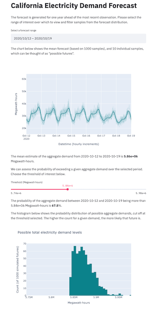
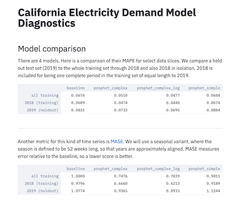
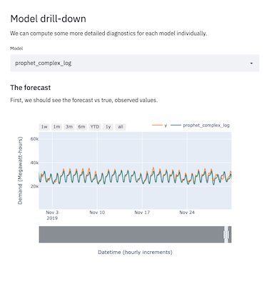

# Structural Time Series

This repo accompanies the Cloudera Fast Forward report [Structural Time Series](https://structural-time-series.fastforwardlabs.com/). It provides an example application of generalized additive models (via the [Prophet](https://facebook.github.io/prophet/) library) to California hourly electricity demand data.

The primary output of this repository is a small application exposing a probabilistic forecast and interface for asking a probabilistic question against it. The final app looks like this.



Instructions are given both for general use (on a laptop, say), and for Cloudera CML and CDSW. We'll first describe what's here, then go through how to run everything.

## Structure

The folder structure of the repo is as follows

```
.
├── apps      # Two small Streamlit applications.
├── cml       # This folder contains scripts that facilitate the project launch on CML.
├── data      # This folder contains starter data, and is where forecasts will live.
├── scripts   # This is where all the code that does something lives.
└── sts       # A small library of useful functions.
```

There's also an `img` folder that contains images for this README. That folder is unimportant and you can ignore it. Let's examine each of the important folders in turn.

### `sts`

This is a small Python library of utility functions useful to our problem. Its structure is as follows:

```
sts
├── data
│   └── loader.py
└── models
    ├── baselines.py
    └── prophet.py
```

Building a small library of problem-specific abstractions allows us to reuse them in multiple places. The code in `data/loader.py`, is reused in most of the scripts and applications. In this case, we have closed model details (such as the number of Fourier terms to include in a given Prophet model) into the library. It would be trivial to pass these through as arguments though, if we wanted to perform an extensive hyperparameter search for example.

### `scripts`

These imperative scripts are where the _work_ of the analysis is done. Side-effectful actions such as I/O and model training occur in these scripts.

```
scripts
├── fit_baseline_model.py
├── fit_simple_prophet_model.py
├── fit_complex_prophet_model.py
├── fit_complex_log_prophet_model.py
├── get_csv.py
├── make_forecast.py
└── validation_metrics.py
```

### `apps`

Two applications accompany this project. Each has a launcher script to assist launching an [Application](https://docs.cloudera.com/machine-learning/cloud/applications/topics/ml-applications.html) with CDSW/CML. To launch the applications in another environment, run the code inside the launcher files, with the prefixed `!` removed. You may need to specify different ports.

```
apps
├── diagnostics.py          # A model comparison and debugging assistant.
├── forecast.py             # The primary forecasting interface.
├── launch_diagnostics.py   # Launcher script for CDSW/CML
└── launch_forecast.py      # Launcher script for CDSW/CML
```

#### Diagnostics

The diagnostic application serves two purposes. First, it computes and reports top level metrics for any forecasts saved in the `data/forecasts` directory.



Second, it provides a few diagnostic charts, including a zoomable forecast.



#### Forecast

The primary forecast application (pictured at the top of this README) is a prototype user interface for the forecast this analysis generates.

### `cml`

These scripts serve as launch instructions to facilitate the automated project setup on CML. Each script is triggered by the declarative pipeline as defined in the `.project-metadata.yaml` file found in the project's root directory.

```
cml
├── install_dependencies.py
└── fit_models_parallel.py
```

## Running through the analysis

There are three ways to launch this project on CML:

1. **From Prototype Catalog** - Navigate to the Prototype Catalog on a CML workspace, select the "Structural Time Series" tile, click "Launch as Project", click "Configure Project"
2. **As ML Prototype** - In a CML workspace, click "New Project", add a Project Name, select "ML Prototype" as the Initial Setup option, copy in the [repo URL](https://github.com/cloudera/CML_AMP_Structural_Time_Series.git), click "Create Project", click "Configure Project"
3. **Manual Setup** - In a CML workspace, click "New Project", add a Project Name, select "Git" as the Initial Setup option, copy in the [repo URL](https://github.com/cloudera/CML_AMP_Structural_Time_Series.git), click "Create Project". Launch a Python3 Workbench Session with at least 4GB of memory and 2vCPUs. Then follow the instructions below, in order.

### Installation

The code and applications within were developed against Python 3.7, and are likely also to function with more recent versions of Python.
In CML or CDSW, start a Python 3 session (with at least 2 vCPU / 4 GiB Memory), and run

```python
!pip3 install -r requirements.txt     # notice `pip3`, not `pip`
!pip3 install prophet==1.1.5
```

Next, install the `sts` module from this repository, with

```python
!pip3 install -e .
```

from inside the root directory of this repo.
If running from the session terminal instead of the REPL, omit the bangs (`!`).

### Data

We use historic California electricity demand data from the [US Energy Information Administration](https://www.eia.gov/opendata/qb.php?category=3389936&sdid=EBA.CAL-ALL.D.H).

A full set of data through October 12th 2020 is included as a starter. More recent data can be fetched from the [EIA open data API](https://www.eia.gov/opendata/). Doing so requires an API key, which must be set as the `EIA_API_KEY` environment variable for this project. To fetch new data, simply call the `load_california_electricity_demand` function from the `sts.data.loader` module. The code is set up to work directly with the json response to the EIA API. By default, each time new data is fetched, it will overwrite the existing data. Similarly, when a new forecast is made, it will overwrite the existing forecast. It would not be hard to adapt the code to maintain a history of fetched data or forecasts if desired.

### Scripts

To fit models and generate forecasts, we call each script in turn from the `scripts` directory.

```bash
python3 scripts/fit_baseline_model.py
python3 scripts/fit_simple_prophet_model.py
python3 scripts/fit_complex_prophet_model.py
python3 scripts/fit_complex_log_prophet_model.py
```

This will fit a series of models of increasing complexity and write their outputs (the mean forecast) to the `data/forecasts` directory. Launching the diagnostic app will show the metrics and diagnostic charts for each model.

The most complex model wins. We can view its metrics when trained on the validation data (through 2019) by running the `scripts/validation_metrics.py` script. We can then generate 1000 samples from the model trained on all available training data with the `scripts/make_forecast.py` script. When those samples are written to disk, we can use the forecast app to investigate them.

The additional script, `get_csv.py`, simply fetches and writes data as a csv, which is convenient for any ad hoc analytics and interactive exploration.
